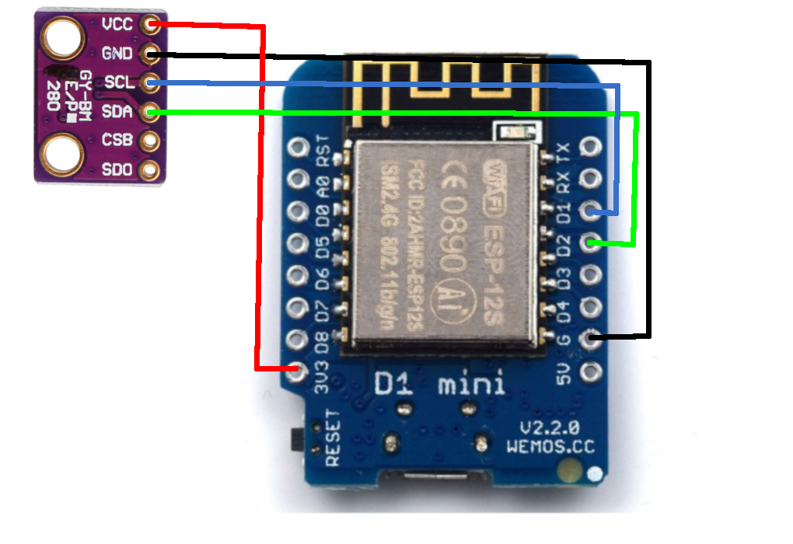

homie.node.bme280
================

Microhomie node for the BME280 sensor to provide *temperature*, *humidity* and *pressure* data.

Install
-------

>>> import upip
>>> upip.install('microhomie-node-bme280')

You'll also need the mpy_bm280 library, which you can find here:
https://github.com/catdog2/mpy_bme280_esp8266
Uplaod it as bme.py

Wiring
-----------------

